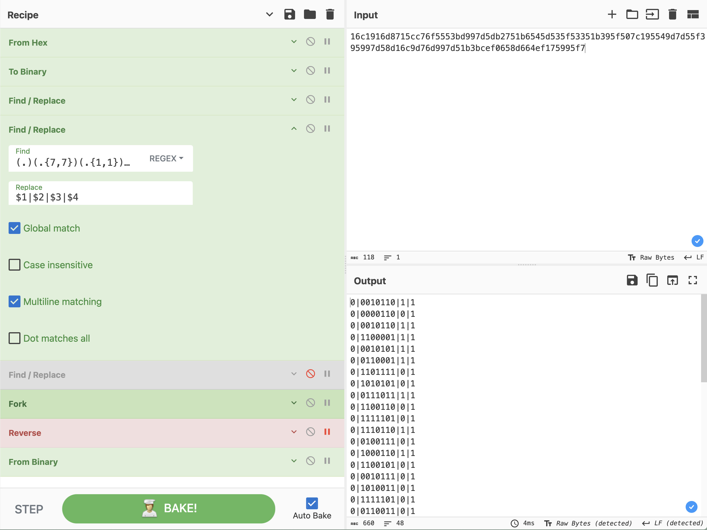

# Serial killer ⚪

[< Go back](../../README.md)

## Description

Et votre prochaine épreuve est... le déménagement ? Vous avez donc invité votre amie haltérophile pour vous donner un coup de main et, en deux temps trois mouvements, tout est déballé et rangé. Tout se passait bien jusqu'au moment de rebrancher votre Arduino à votre PC. Elle essaie de rebrancher le port USB, mais ne dose pas sa force et... CRAC ! Le port se casse ! Cet événement vous affecte grandement.

Vous décidez de récupérer et de déchiffrer les dernières paroles que votre Arduino avait transmises à votre ordinateur afin de pouvoir les ajouter à son épitaphe.

<https://docs.arduino.cc/learn/communication/uart/#technical-specifications>

all files in [resources/](./resources) were provided.

## Challenge

After delving into the documentation for UART (the one provided) and looking at how Arduino encodes ascii chars ([ASCII Table arduino](https://docs.arduino.cc/built-in-examples/communication/ASCIITable/)) we can star to look for patterns in the data we are provided,

First let's extract everything from the binary data we are given:

```bash
xxd -plain chall.bin | tr -d '\n'
# 16c1916d8715cc76f5553bd997d5db2751b6545d535f53351b395f507c195549d7d55f395997d58d16c9d76d997d51b3bcef0658d664ef175995f7
```

We are looking for clear patterns:

- start bit (`0`)
- end bit (`1`)
- the size of binary we are supposed to read, (6bit, 7bit, 8bit ?)
- parity bits
- try to match some basic characters, for example `404CTF{`, which in "Arduino ASCII" is `0110100 0110000 0110100 1000011 1010100 1000110 1111011`

After lots of trial and error, I found what I was looking for, two perfect columns of 0s for start bits, and 1s for end bits.

From that I isolated what looks to be the parity bit, and finally it was a matter of reversing the binary to swap endianess, here is the final Cyberchef recipe for input `16c1916d8715cc76f5553bd997d5db2751b6545d535f53351b395f507c195549d7d55f395997d58d16c9d76d997d51b3bcef0658d664ef175995f7`:

```
From_Hex('Auto')
To_Binary('None',8)
Find_/_Replace({'option':'Regex','string':'^'},'',true,false,true,false)
Find_/_Replace({'option':'Regex','string':'(.)(.{7,7})(.{1,1})(.)'},'$2 ',true,false,true,false)
Find_/_Replace({'option':'Regex','string':'..$'},'',true,false,true,false)
Fork(' ','\\n',false)
Reverse('Character')
From_Binary('Space',8)
```

So in the end we can deduce the Serial configuration used was `SERIAL_7E1` for 7 bits and 1 even parity bit.



Flag: `404CTF{Un3_7r1Ste_f1N_p0Ur_uN3_c4r73_1nn0c3nt3}`
