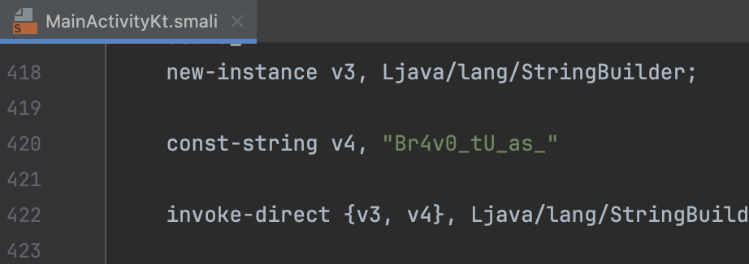
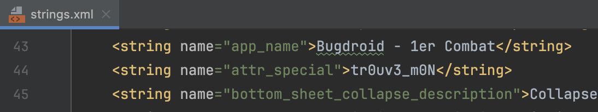
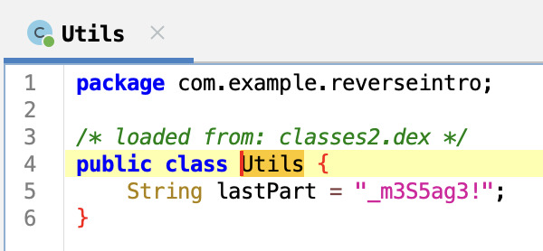

# Bugdroid Fight 1 🟡

[< Go back](../../README.md)

## Description

Un Bugdroid sauvage apparait !

Il est temps de mettre vos compétences de boxe en pratique, mais attention, cette fois il n'y a ni ring ni arbitre. Assurez-vous de bien observer autour de vous car, comme sur le ring, il est important de connaître les habitudes de son adversaire. Bon courage,

Retrouvez le message du Bugdroid.

Format de flag : `404CTF{message}`

all files in [resources/](./resources) were provided.

## Challenge

First decompiled with `JADX-GUI` this had lots of resources missing, I then just used `apktool` and opened the code in `android studio`

Flag: `404CTF{Br4v0_tU_as_tr0uv3_m0N_m3S5ag3!}`
