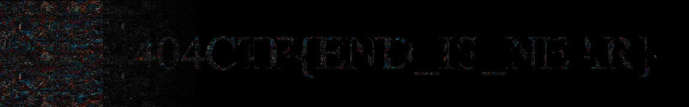

# Regarder en stéréo 🟡

[< Go back](../../README.md)

## Description

Ça y est, c'est le grand jour!

Vous avez enfin atteint le niveau professionnel et, il faut faire vos preuves lors de cette première compétition. Le début de votre enchaînement gymnastique se déroule bien jusqu'à ce que votre plus grande peur se réalise. Une mauvaise réception en amenant une autre, vous ne contrôlez plus votre élan et tentez de vous rattraper tant bien que mal. Malheureusement, vous finissez par atterrir un peu trop loin en dehors des tapis.

Voici la dernière vision que vous avez avant de heurter le sol, est-ce que quelque chose peut encore vous aider?

all files in [resources/](./resources) were provided.

## Challenge

Stéréo, might mean looking at the image being crosseyed, doing that does show something, but it's very hard to read, I found a website that can simulate this process <https://magiceye.ecksdee.co.uk/>

Flag: `404CTF{END_IS_NEAR}`
