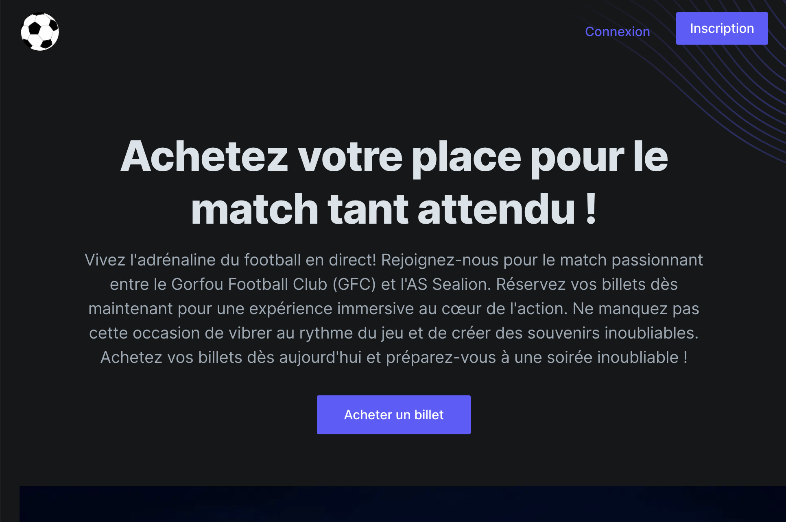
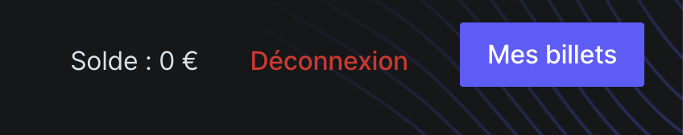
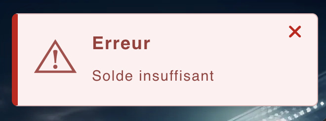
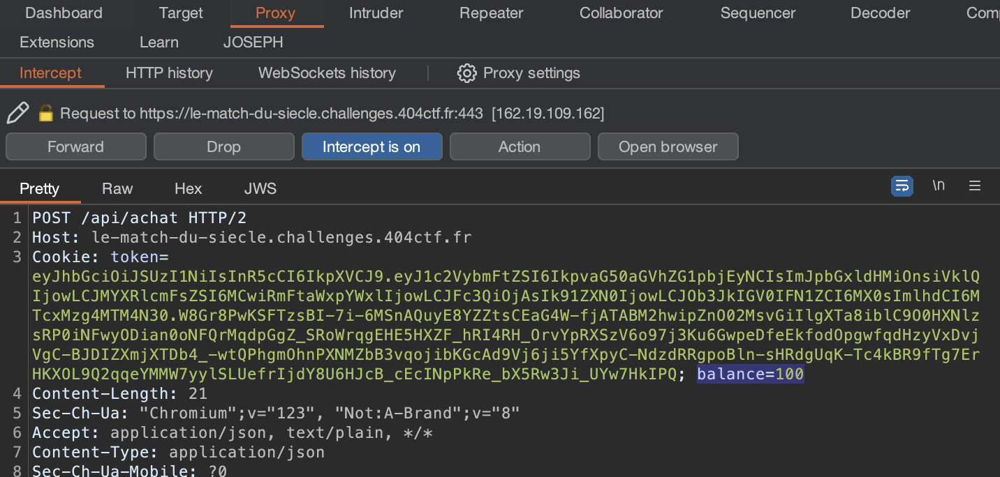
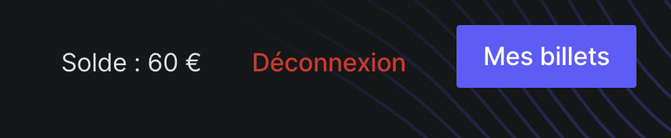
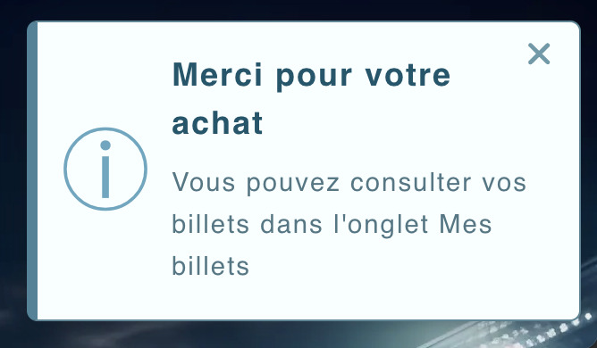
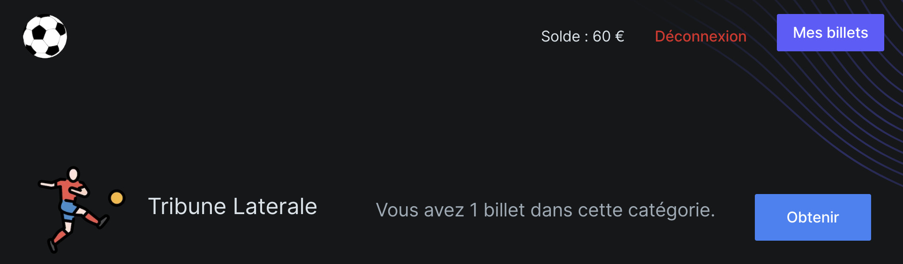
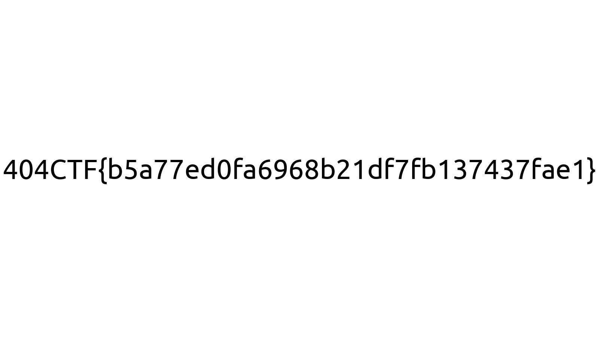

# Le match du siècle 1 ⚪

[< Go back](../../README.md)

## Description

Vous voilà à quelques semaines du match tant attendu entre le Gorfou FC et l'AS Sealion.
Seulement, vous vous êtes pris au dernier moment pour acheter votre place. Trouvez un moyen d'obtenir un billet !

<https://le-match-du-siecle.challenges.404ctf.fr>

all files in [resources/](./resources) were provided.

## Challenge

Let's first create an account and login. This is a ticket e-store for a football match, let's try to buy a ticket.

We don't have enough money to do that, let's intercept the buy request with burp and see what we can do.

In the user cookies we learn of a `balance=0` let's try to set that to a higher value:

And forward the request, it works! We got the ticket

Let's "Obtain" it:

This downloads the flag as a png

