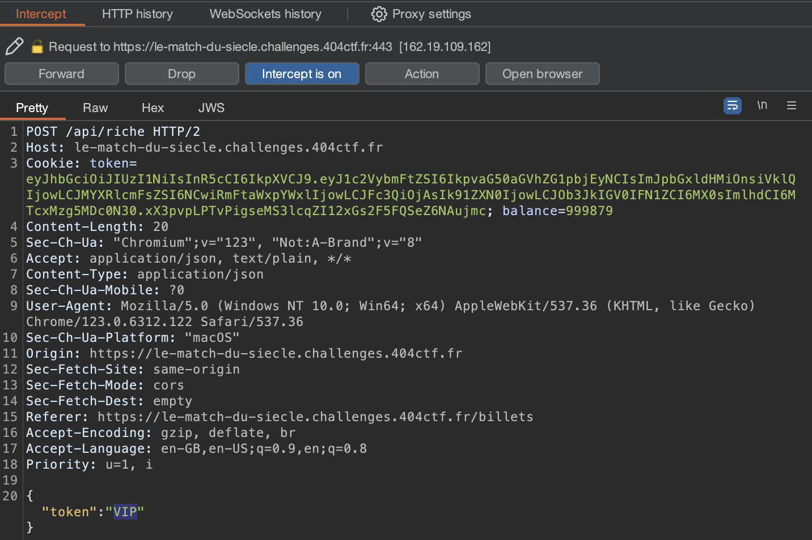
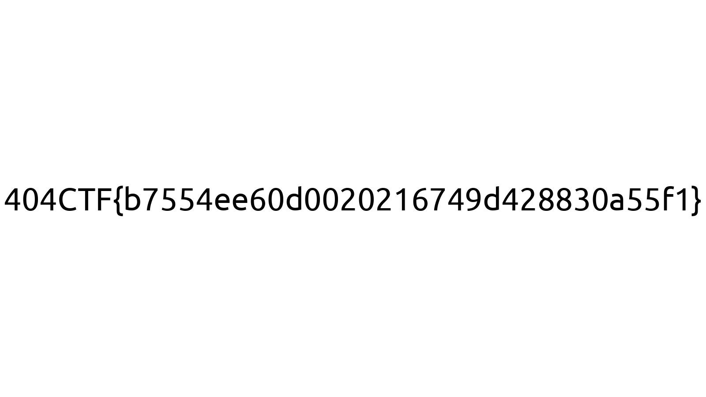

# Le match du siècle 2/2 🟠

<a class="back-link" href="../../">< Go back</a>

## Description

Vous avez déjà en votre possession un billet, néanmoins, pour impressionner votre famille, vous souhaiteriez des places VIP.

<https://le-match-du-siecle.challenges.404ctf.fr>

all files in [resources/](./resources) were provided.

## Challenge

We start from [Le match du siècle 1/2 ⚪](../Le_match_du_siecle_1/), from the ticket "Obtain button" we intercept the request with Burp.

Here we see some data at the end if we specify that we want to download the "ticket" for `VIP` we get our flag.

