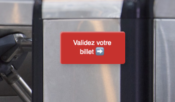
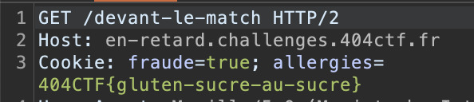

# Vous êtes en RETARD ⚪

[< Go back](../../README.md)

## Description

Vous voilà devant le stade pour voir le dernier match de votre équipe préférée, le Gorfou FC !
Malheureusement, vous êtes arrivé.e en retard et l'entrée est fermée... Mais pas de panique, il vous suffit de trouver un moyen pour quand même rentrer !

<https://en-retard.challenges.404ctf.fr>

all files in [resources/](./resources) were provided.

## Challenge

First page at the end we have some js and a path (the button should lead to the path but it did not work for me for some reason).

```js
document.querySelector('.entrer-dans-le-stade').addEventListener('click', function() {
    window.location.href = '/donnez-moi-mon-ticket-pitie';
});
```

We have to access `/set_cookie` which doesn't do anything by itself:

```js
var bouton = document.querySelector('.valider-billet');
var billet = document.querySelector('.billet');
window.validable = [];
bouton.addEventListener('click', function() {
    if (window.validable.includes(billet.id)) {
        fetch('/set_cookie', {method: 'POST'}).then(function() {
            window.location.href = "/devant-le-match";
        });
    } else {
        alert('Billet non validé');
    }
});
```

We need to grab the id of the ticket (``) and putting it inside `window.validable`, we can do that in the console:

```js
window.validable = ['053HJ28LOS'];
```

And then just clicking on the button



And we get the flag


