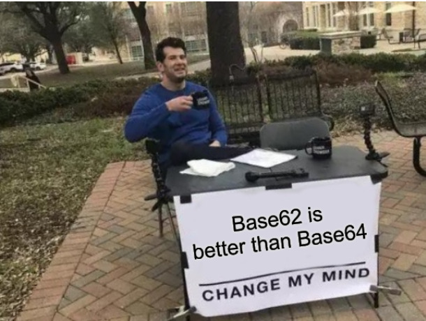

# ⭐⭐ Hidden Secrets

[< Go back](../../README.md)

In the last week we have been analyzing all data that was collected from the workstation of a suspicious individual in the context of an investigation we are assisting on.
We are still looking for some sensitive data that might be crucial for the investigation.
Unfortunately, our forensic experts are not available at the moment and we need to know more about a suspicious zip file.
The zip file is encrypted, but we already managed to crack it by blasting rockyou on it.
However, we are none the wiser and really need results, the sooner the better.
Can you assist and have a look?

The password is 'hiddensecrets'.

We were given the [unknown.zip](./unknown.zip) folder. which I extracted to [files/](./files).

----

Looking at the files, they appear to not be any specific type of file, one thing that stands out though is their extension, they all have a number from 0 to 27:

```
3Ycs.0    SD8V.14
X0kW.1    RfaM.15
kjg6.2    6sJo.16
vQtH.3    PGl5.17
gnUv.4    GVbA.18
4Me9.5    JIw7.19
lAzJ.6    XSYT.20
TyV8.7    UVAk.21
R8yC.8    dYfr.22
iqQ3.9    UfBu.23
u7Sc.10   X62A.24
yIKl.11   s8Kz.25
ZDgw.12   Is47.26
zYrx.13   5DnZ.27
```

Let's concat all of them into one file, and look at it's type:

```bash
touch out
for i in $(cat ./correct_order); do cat files/$i >> out; done

file out
out: Keepass password database 2.x KDBX
```

Perfect a KDBX, though while trying to get the contents we see that it's password protected.

Let's use John the Ripper to crack it:

```bash
keepass2john out.kdbx | grep -o "$keepass$.*" > hash.txt # This is kind of dumb, but keepass2john appends `<filename>:` to the start of the hash.
john hash.txt --wordlist=/usr/share/wordlists/rockyou.txt
```

After letting it run for a bit, we get the password: `babyface123`.

Let's get the KDBX contents:

```bash
keepassxc out.kdbx
```

Submit the password and we get access to the vault, the first thing we see is a list of useless files that tell us "YOU ARE TOO LATE I WIPED EVERYTHING ALREADY", we also find a TODO list, with one notable thing: "Move most important secrets outside the vault: DONE", that might indicate that the flag is in a previous step.

Looking even further into the vault we find that the Notes have a history, and one of the entries is way larger than the others, inside it we find an image:


So we are looking for a base62 encoded string somewhere outside the vault, one thing that stands out is the 28 files from the beggining, the name of files contained random characters, which could be a base62 encoded string, let's try that:

```
3YcsX0kWkjg6vQtHgnUv4Me9lAzJTyV8R8yCiqQ3u7ScyIKlZDgwzYrxSD8VRfaM6sJoPGl5GVbAJIw7XSYTUVAkdYfrUfBuX62As8KzIs475DnZ

We get:
kjgvchf_I_Guess_This_Is_What_You_Are_Looking_For:CSC{Base64IsTooMainstreamAmirite?}
```

And that's the flag.
