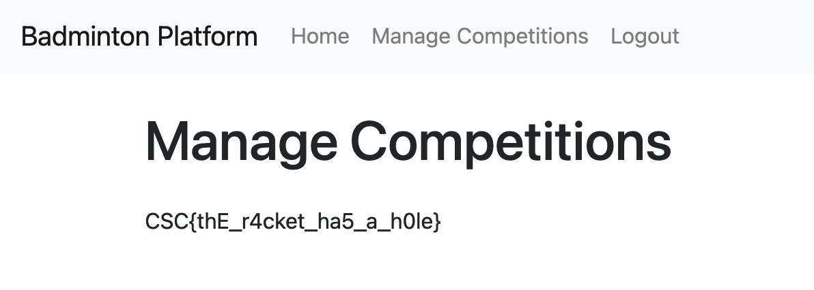

# Shuttle ⭐

[< Go back](../../README.md)

## Description

My badminton club has a nice application to register for upcoming competitions.
I'm tempted to perform security tests, however, that would be unethical of me.
However, I think it's safe to say that you can have a look ¯\_(ツ)_/¯.

A website and [App/](./App/) were provided.

## Challenge

After looking at the app.py code, we can see that there is a `/manage-competitions` route, this appears to be restricted to `admin` roles only, but while registering, we can also specify a role as seen here:

```py
role = request.form.get(
    "role", "user"
)  # Get the selected role, default to 'user' if not set
```

From this information we will use BurpSuite to intercept the `POST /register` request, we don't forge the request from scratch as there seems to be cookies and session identifiers, let's not bother with all that.

Just enable intercept mode in the Proxy, and when the request is captured, send it to the Repeater and drop the request from the Proxy. You should see:

```
POST /register HTTP/1.1
// Bla bla bla, headers...

username=<username>&password=<password>
```

From this we just add a `&role=admin` to the end of the request data, send the request, and we have successfully created a admin account, let's go onto the the website and login via the `/login` page.

And we can see a new special tab appear at the top, clicking on it reveals the flag:


