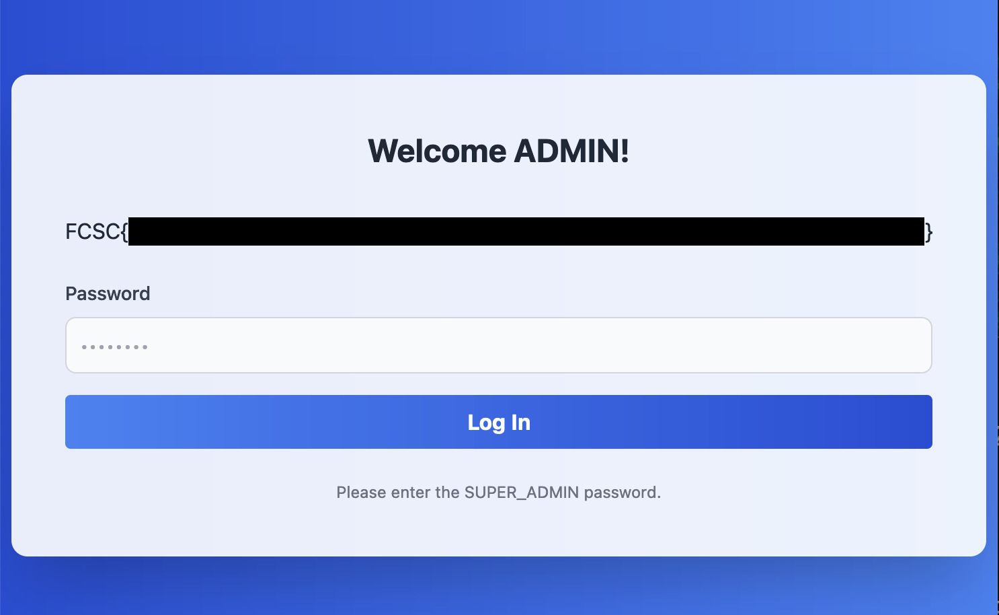

# Welcome Admin 1 & 2 ⭐

<a class="back-link" href="../../">< Go back</a>

## Description

Au coeur d'un réseau labyrinthique, là où la lumière des écrans peine à éclairer les recoins les plus sombres, une demande spéciale est lancée dans les abîmes, un appel discret, attendu seulement par ceux qui connaissent les profondeurs. Seul un véritable expert pourra répondre à l'appel, cryptiquement formulé : "Un expert en SQL est demandé à la caisse numéro 3."

<https://welcome-admin.france-cybersecurity-challenge.fr/>

all files in [resources/](./resources) were provided.

## Challenge

After looking at [welcome-admin.py](resources/src/welcome-admin.py) we can see that this challenge consits of different levels of difficulty where we have to attempt SQLi to gets flags.

Here are the different roles:

```py
class Rank(Enum):
    GUEST = 0
    ADMIN = 1
    SUPER_ADMIN = 2
    HYPER_ADMIN = 3
    TURBO_ADMIN = 4
    FLAG = 5
```

One thing to note before going any further, `;` are banned from the passwords, including them will automatically result in a 400. This is due to the check done in the decorator used for every single login page:

```py
password = request.form.get("password", "")
if ";" in password:
    return abort(400)
```

### Become Admin


First step is pretty straightforward we don't have much choice, we get a login screen and are expected to get a password.

In the backend we see the vulnerable code that verifies our authenticity:

```py
token = os.urandom(16).hex()
cursor.execute(f"SELECT '{token}' = '{password}'")
```

Let's try to attempt a very basic SQLi: `' OR 1=1'`, this results in a 500 error, I tried adapting the SQLi to keep strings as much as possible, and ended up with `' OR '1'='1` this worked!

### Become Super Admin

_Note: We get the first flag for the `Intro/Welcome_Admin_1` challenge, our flag is at the final admin account_



Let's keep going, here is the code to access super admin:

```py
token = os.urandom(16).hex()
cursor.execute(
    f"""
        CREATE FUNCTION check_password(_password text) RETURNS text
        AS $$
            BEGIN
                IF _password = '{token}' THEN
                    RETURN _password;
                END IF;
                RETURN 'nope';
            END;
        $$
        IMMUTABLE LANGUAGE plpgsql;
    """
)
cursor.execute(f"SELECT  check_password('{password}')")
```

Still the same general idea but a little bit more intricate, now we have two choices, either we try to exploit the `check_password` function or we try to bypass it.

Let's first try to bypass it, this will allow us to stay in the SQLi mindset.
