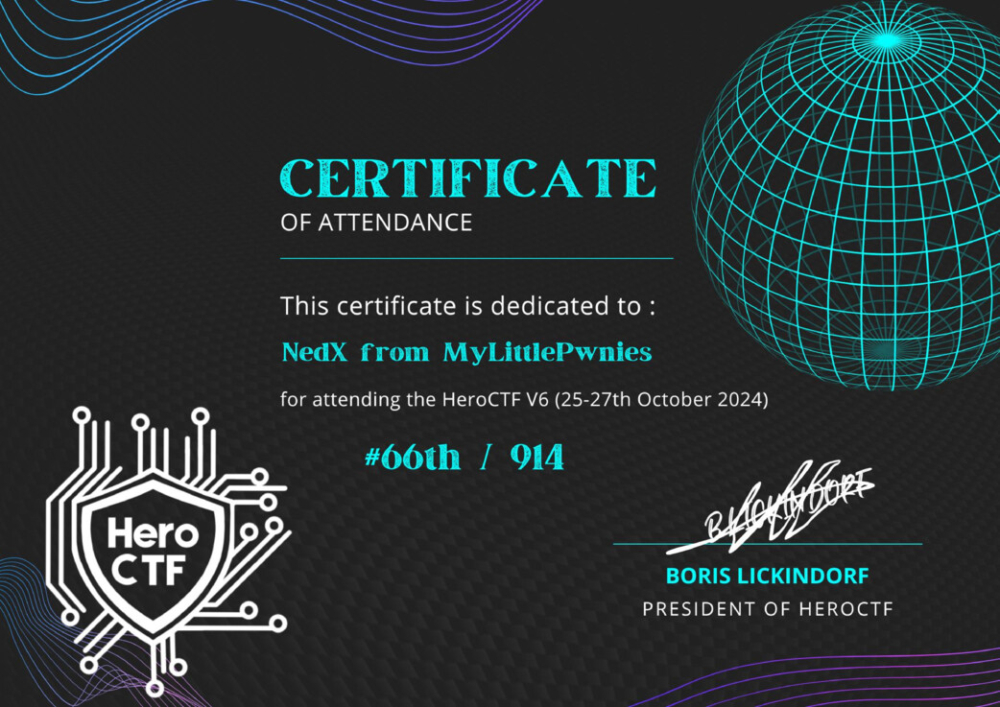

# HeroCTF v6

[< Go back](../../README.md)

<!-- ✅ ⏯️ ⭐ ⚪ 🟡 🟠 🔴 ⚫ 🚩 -->

## Status

| Id | Description       |
|----|-------------------|
| ⏯️ | On-going / Paused |
| ✅ | Finished          |

## Grades

| Id | Name         | Type    | Point(s)      |
|----|--------------|---------|---------------|
| ⚪ | very easy    | dynamic | 50 - 500pts   |
| 🟡 | easy         | dynamic | 50 - 500pts   |
| 🟠 | medium       | dynamic | 50 - 500pts   |
| 🔴 | hard         | dynamic | 50 - 500pts   |
| ⚫ | misc         | static  | 10 to 150pts  |

## Challenges

## Pwn

- ✅ [Heappie ⚪](./Pwn/Heappie/README.md)
- ✅ [BankRupst 🟡](./Pwn/BankRupst/README.md)

## Reverse

- ✅ [AutoInfector ⚪](./Reverse/AutoInfector/README.md)

## Web

- ✅ [Jinjatic 🟡](./Web/Jinjatic/README.md)
- ✅ [PrYzes ⚪](./Web/PrYzes/README.md)
