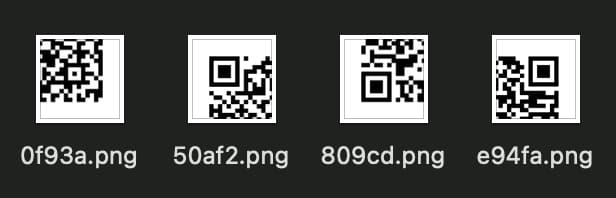
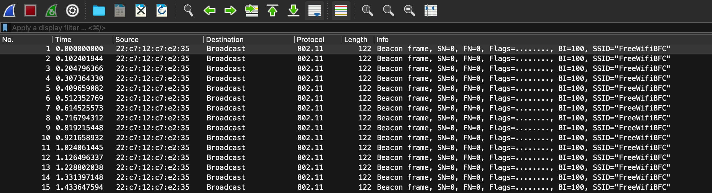
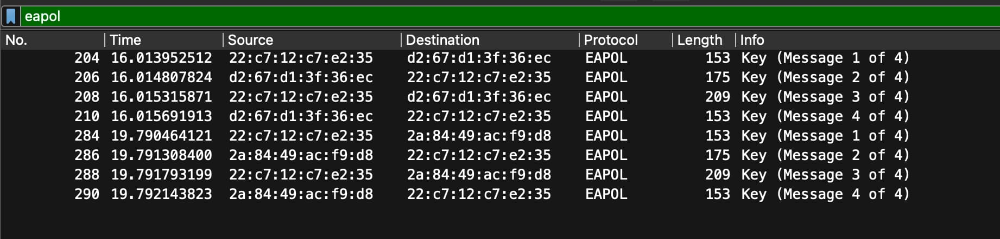
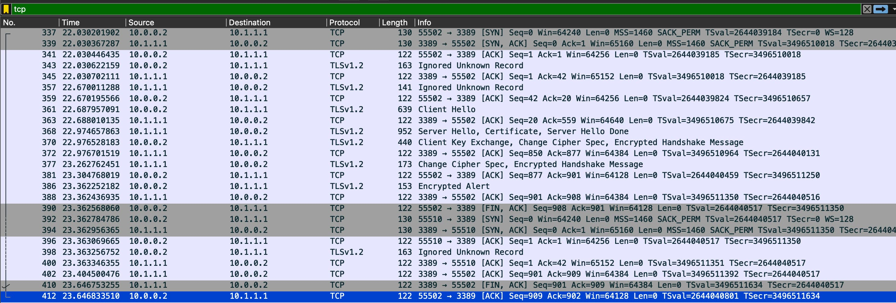
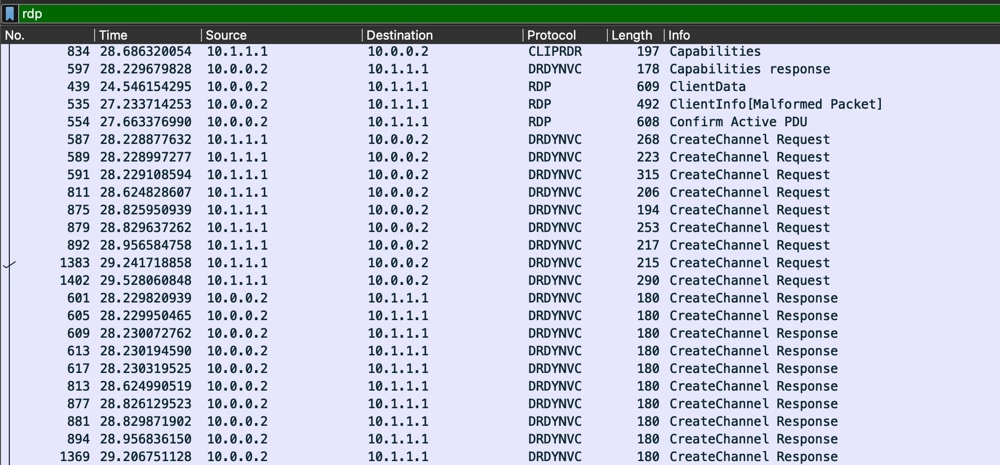
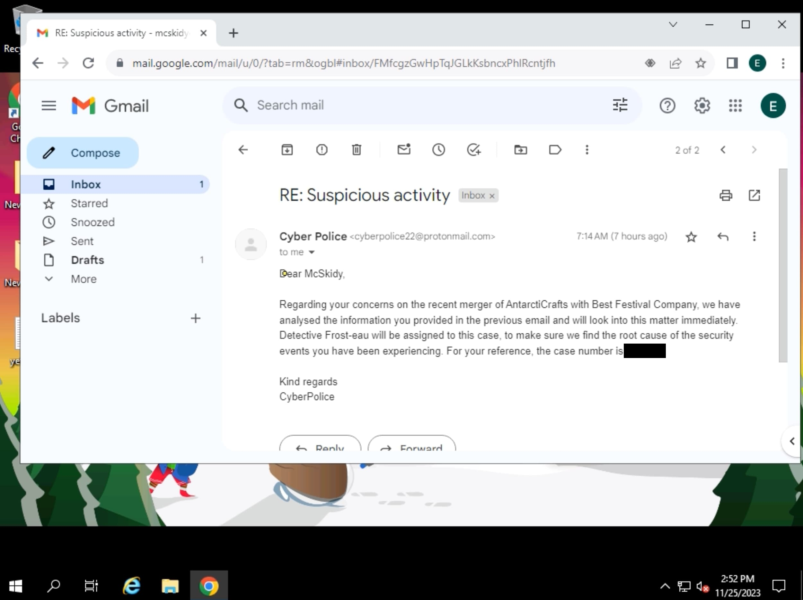

# Advent of Cyber 2023 - Side Quest 1

## Context

The Advent of Cyber is a series of 25 challenges that walk through the basics of cybersecurity. The level is very begginer friendly, but this year (2023) they added a series of 4 Side Quests that are on a range of "Hard" to "Insane" according to their creators.

## Write-up

### Accessing the challenge

4 pieces of QR code to find. One directly given on TryHackMe, then LinkedIn, Discord and finally Twitter.\
Pasting them all together gives the private URL to the challenge.



### Reconnaisance

To begin with, we have access to a `.pcapng` file containing 45k packets.



8 of them are EAPOL (i.e. 2 WiFi 4-way handshakes) and the rest are 802.11 communication packets.



Looking at these packets, we find the ESSID of the network.

> 1/ What's the name of the WiFi network in the PCAP?\
> `<redacted1>`

### Cracking SSL

Let's isolate both 4-way handshakes into a new `.pcap` file so we can try to brute force the password of the network. First let's check if `airodump-ng` can detect the handshakes:

```bash
airodump-ng -r handshakes.pcap
#  CH  0 ][ Elapsed: 0 s ][ 2024-01-23 23:28 ][ Finished reading input file handshakes.pcap.

#  BSSID              PWR  Beacons    #Data, #/s  CH   MB   ENC CIPHER  AUTH ESSID

#  22:C7:12:C7:E2:35    0        0        8    3   6   -1   OPN              <length:  0>

#  BSSID              STATION            PWR   Rate    Lost    Frames  Notes  Probes

#  22:C7:12:C7:E2:35  2A:84:49:AC:F9:D8    0    1 - 1      0        4  EAPOL
#  22:C7:12:C7:E2:35  D2:67:D1:3F:36:EC    0    1 - 1      0        4  EAPOL
```

Let's grab both the BSSID (`22:C7:12:C7:E2:35`) and ESSID (`<redacted1>`) of the network and run it through `aircrack-ng` using `rockyou.txt` as the wordlist:

```bash
aircrack-ng -w rockyou.txt -b "22:C7:12:C7:E2:35" -e "<redacted1>" handshakes.pcap
# Reading packets, please wait...
# Opening handshakes.pcap
# Read 8 packets.
#
# 1 potential targets
#
#                                Aircrack-ng 1.7
#
#       [00:00:04] 33977/14344392 keys tested (7870.89 k/s)
#
#       Time left: 30 minutes, 18 seconds                          0.24%
#
#                            KEY FOUND! [ <redacted2> ]
#
#
#       Master Key     : A8 3F 1D 1D 1D 1F 2D 06 8E D4 47 CE E9 FD 3A AA
#                        B2 86 42 89 FA F8 49 93 D7 C1 A0 29 97 3D 44 9F
#
#       Transient Key  : 00 00 00 00 00 00 00 00 00 00 00 00 00 00 00 00
#                        00 00 00 00 00 00 00 00 00 00 00 00 00 00 00 00
#                        00 00 00 00 00 00 00 00 00 00 00 00 00 00 00 00
#                        00 00 00 00 00 00 00 00 00 00 00 00 00 00 00 00
#
#       EAPOL HMAC     : C1 0A 70 D9 65 94 5B 57 F2 98 8A E0 FC FD 2B 22
```

> What's the password to access the WiFi network?\
> `<redacted2>`

We go back to the `.pcapng`, now that we have the password, we can decrypt the traffic by going in `Preferences` > `Protocols` > `IEEE 802.11` > `Edit` > `Add/+`, create a new `wpa-pwd` entry and give it the value of: `<redacted2>:<redacted1>`.



### Decrypting TLS

Now we have more interesting information in the TCP streams that used to be encrypted, most of them are junk, but two stand out: `1` and `1005`.

- `1` is a long gibberish conversation between the client and the server. At the beggining there are some readable strings:

    ```
    Cookie: mstshash=elf
    INTERN-PC0
    231122211819Z
    240523211819Z INTERN-PC0
    ```

    This looks like a RDP session but it's fully encrypted.

- `1005` this is a windows powershell session, where a malicious person downloaded `<redacted3>` on the machine, extracted the public/private certificates, and printed the contents of the private cert as base64 then left.

    ```powershell
    PS C:\Users\Administrator> [Convert]::ToBase64String([IO.File]::ReadAllBytes("/users/administrator/LOCAL_MACHINE_Remote Desktop_0_INTERN-PC.pfx"))
    MIIJuQIBAzCCCXUGCSqGSIb3DQEHAaCCCWYEggliMIIJXjCCBecGCSqGSIb3DQEHAaCCBdgEggXUMIIF0DCCBcwGCyqGSIb3DQEMCgECoIIE/jCCBPowHAYKKoZIhvcNAQwBAzAOBAiAw9dZ0qgvUQICB9AE...
    ```

> What suspicious tool is used by the attacker to extract a juicy file from the server?\
`<redacted3>`

Let's try to decrypt the RDP session, using this new private certificate. We grab the base64 code, turn it back into bytecode and store it as a `.pfx` file then using openssl we can extract the actual private key:

```bash
openssl pkcs12 -in cert.pfx -nocerts -out key.pem -nodes
```

We are prompted for a password, which `<redacted3>` sets to `<redacted3>` by default.

Now that we have the `key.pem` private key, first let's filter for the RDP communication stream: `tcp.stream eq 1` this will help to have in the background while filling in the necessary information for the TLS key.

We can go back into `Preferences` > `Protocols`, but this time into `TLS` and add a new RSA key.

By looking at who is communicating via TLSv2 (source) we can get the necessary info:

```md
- IP Address: 10.1.1.1
- Port: 3389
- Protocol: We would think this is `rdp` or `tls`, but it's actually `tpkt`.
- Key file: [path to our key.pem]
```

Submit and we get the decrypted TLS. Let's just check that this worked correctly, filter by `rdp` you should see a bunch of packets, select one and do `Follow...` > `TLS Stream`, you should be able to see the information of the RDP protocol establishing connection and configuration at the start, for example:

```
[...]
cliprdr.....rdpsnd......snddbg......rdpdr.......drdynvc
[...]
.....;...h.....-%.........Microsoft::Windows::RDS::Telemetry........h................ECHO....H...h.....:2........ Microsoft::Windows::RDS::Video::Control::v08.01....E...h.....7/........
Microsoft::Windows::RDS::Video::Data::v08.01....B...h.....4,.........Microsoft::Windows::RDS::Geometry::v08.01
```



### RDP analysis

Now let's try to convert this RDP data into an mp4 using a very cool tool: [pyrdp](https://github.com/GoSecure/pyrdp). It has a whole suite of tools, we will be using `pyrdp-convert` and `pyrdp-player`. (The pyrdp github repo README has a very nice tutorial on how to do all of this btw)

Ensure you still have your SSL key in the IEEE 802.11 protocol preferences and your TLS key in the TLS protocol preferences. At the moment this is all superficial, the decryption is specific to your wireshark session and not to the file, we need to export the unencrypted data and cleanup the mess that is our current `.pcapng` file for `pyrdp-convert` to understand.

Let's start by exporting our configs using the `File` > `Export PDU's to File`, choose `OSI Layer 7` to grab everything unencrypted. Now let's export the RDP communication, `File` > `Export Specified Packets...`, select `.pcap` as that is the prefered format for `pyrdp-convert`.

You should now have a brand new file, let's check if `pyrdp-convert` can understand it:

```bash
pyrdp-convert  --list-only VanSpy-filtered.pcap
# [*] Analyzing PCAP 'VanSpy-filtered.pcap' ...
#    - 10.0.0.2:55510 -> 10.1.1.1:3389 : plaintext
```

#### RDP to mp4

```bash
pyrdp-convert -f mp4 VanSpy-filtered.pcap
# [*] Analyzing PCAP 'VanSpy-filtered.pcap' ...
#     - 10.0.0.2:55510 -> 10.1.1.1:3389 : plaintext
# [*] Processing 10.0.0.2:55510 -> 10.1.1.1:3389
#  43% (3203 of 7405) |#######################################################                                                                         | Elapsed Time: 0:01:03 ETA:   0:01:24
# [-] Failed to handle data, continuing anyway: unpack requires a buffer of 4 bytes
#  72% (5359 of 7405) |############################################################################################                                    | Elapsed Time: 0:02:05 ETA:   0:00:42
# [-] Failed to handle data, continuing anyway: unpack requires a buffer of 4 bytes
#  99% (7393 of 7405) |############################################################################################################################### | Elapsed Time: 0:03:05 ETA:   0:00:00
# [-] Failed to handle data, continuing anyway: Trying to parse unknown MCS PDU type 12
# 100% (7405 of 7405) |################################################################################################################################| Elapsed Time: 0:03:05 Time:  0:03:05

# [+] Successfully wrote '20231125145052_10.0.0.2:55510-10.1.1.1:3389.mp4'

```

By watching the video we can see that the user is going trough the emails.



> What is the case number assigned by the CyberPolice to the issues reported by McSkidy?\
> `<redacted4>`

#### RDP to pyrdp

For the last question, we have to find the contents of the `yetikey1.txt` file, unfortunately for us, we only converted to mp4, so we lost a lot of intersting information, to correctly visualize the entire process with all RDP features that were enabled we need to convert the `.pcap` into a `.pyrdp` format, this can then be understood by `pyrdp-player`.

```bash
pyrdp-convert VanSpy-filtered.pcap
# [*] Analyzing PCAP 'VanSpy-filtered.pcap' ...
#     - 10.0.0.2:55510 -> 10.1.1.1:3389 : plaintext
# [*] Processing 10.0.0.2:55510 -> 10.1.1.1:3389
#  39% (2931 of 7405) |##################################################                                                                              | Elapsed Time: 0:00:00 ETA:   0:00:00
# [-] Failed to handle data, continuing anyway: unpack requires a buffer of 4 bytes
#  68% (5109 of 7405) |########################################################################################                                        | Elapsed Time: 0:00:01 ETA:   0:00:00
# [-] Failed to handle data, continuing anyway: unpack requires a buffer of 4 bytes
#  97% (7208 of 7405) |############################################################################################################################    | Elapsed Time: 0:00:01 ETA:   0:00:00
# [-] Failed to handle data, continuing anyway: Trying to parse unknown MCS PDU type 12
# 100% (7405 of 7405) |################################################################################################################################| Elapsed Time: 0:00:01 Time:  0:00:01

# [+] Successfully wrote '20231125145052_10.0.0.2:55510-10.1.1.1:3389.pyrdp'
```

Let's now open it:

```bash
pyrdp-player 20231125145052_10.0.0.2:55510-10.1.1.1:3389.pyrdp
```

This opens the video with a very basic media player, and a data stream that logs everything that is going on, according to the RDP settings. In our current case it's pretty much a keylogger + clipboard logger.

At some point in the video the user executes the following command to copy the contents of the `yetikey1.txt` file into the clipboard:

```powershell
Set-Clipboard -value (Get-Content .\Desktop\yetikey1.txt)
```

And we can see the following appear in the data stream:

```
--------------------
CLIPBOARD DATA: Set-Clipboard -value (Get-Content .\Desktop\secret.txt.txt)

[...]
--------------------
CLIPBOARD DATA: <redacted5>
```

> What is the content of the `yetikey1.txt` file?\
> `<redacted5>`
