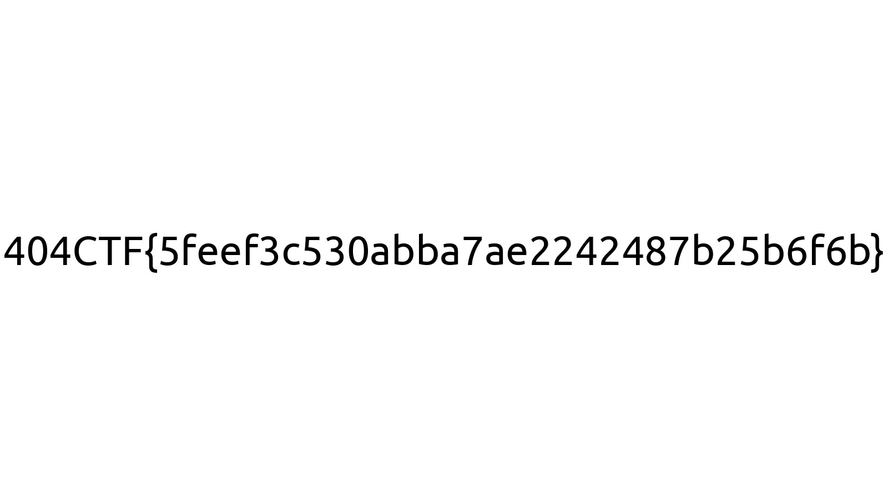

# De la friture sur la ligne ⚪

<a class="back-link" href="../../">< Go back</a>

## Description

Vous êtes parti ce matin pour une compétition de pêche au bord de la rivière près de chez vous. Malheureusement vous n'avez récupéré que de la friture sur votre ligne et vous êtes fait battre à plate couture. Dépité, sur le chemin du retour, vous tombez sur une étrange clé USB...

[Bit de parité](https://fr.wiktionary.org/wiki/bit_de_parit%C3%A9#Locution_nominale)

all files in [resources/](./resources) were provided.

## Challenge

We are told about the `parity bit`, this concept of storing a single bit of info that can be used to verify the whole integrity of the data it is associated with.

No need to search for any data protocol standards or anything, this seems to be a simple custom solution:

```py
def encode_data(d):
  return list(d)+[sum([e for e in d])%2]
```

This function doesn't really encode anything, it gets a list of 7 bits and appends a "parity bit" at the end which tells if the 7 previous bits are even or odd.

Later on we see an "error" that occured on each 4th bit, where the data got corrupted:

```py
def bad_channel(data):
  return (data+np.random.randint(low=0,high=2,size=data.size,dtype='uint8'))%2

from_channel_4 = bad_channel(to_channel_4)  # Oups :/
```

We don't really care about that randomness, if we have just one value we don't know, we can find the correct value using the `parity bit`, let's think about it.

First let's define our two values we have to compare:

```
b = b8
B = (b1, b2, b3, b5, b6, b7) % 2
```

From this we can think about all possible outcomes and make a boolean table for the expected outcomes for b4:

| `b` | `B` | `b4` |
|---|----|----|
| 0 | 0  | 0  |
| 0 | 1  | 1  |
| 1 | 0  | 1  |
| 1 | 1  | 0  |

It's a XOR! Let's solve the challenge:

```py

with open('channel_1', 'r') as fd1:
  f1 = [int(n) for n in fd1.read()]
with open('channel_2', 'r') as fd2:
  f2 = [int(n) for n in fd2.read()]
with open('channel_3', 'r') as fd3:
  f3 = [int(n) for n in fd3.read()]
with open('channel_4', 'r') as fd4:
  f4 = [int(n) for n in fd4.read()]
with open('channel_5', 'r') as fd5:
  f5 = [int(n) for n in fd5.read()]
with open('channel_6', 'r') as fd6:
  f6 = [int(n) for n in fd6.read()]
with open('channel_7', 'r') as fd7:
  f7 = [int(n) for n in fd7.read()]
with open('channel_8', 'r') as fd8:
  f8 = [int(n) for n in fd8.read()]


file = np.array([], dtype='uint8')

for i in range(len(f8)):
  b = f8[i]
  B = ((f1[i] + f2[i] + f3[i] + f5[i] + f6[i] + f7[i]) % 2)

  bits = [f1[i], f2[i], f3[i], b ^ B, f5[i], f6[i], f7[i]]
  file = np.append(file, bits)

with open("flag.jpg", "wb") as fd:
  fd.write(np.packbits(file))

```


