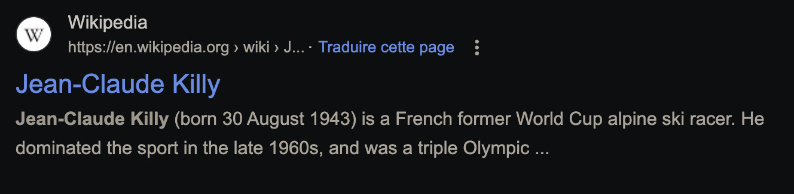
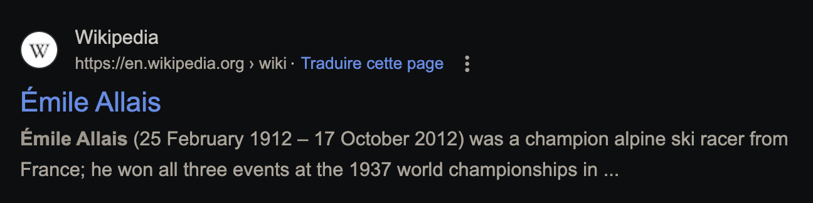

# Légende ⚪

<a class="back-link" href="../../">< Go back</a>

## Description

Sur cette photo, une des premières légendes du ski français s'apprête à franchir la ligne d'arrivée et remporter son troisième titre de champion du monde cette année. Saurez-vous retrouver son nom et prénom ainsi que le nom de la ville dans laquelle ces compétitions ont eu lieu ?

Format du flag : 404CTF{eric-dupont_tokyo}

all files in [resources/](./resources) were provided.

## Challenge

Reverse image search doesn't yield anything, doing a quick google search we find:

I tried some with Jean-Claude Killy which was a pain because the composed name is weird to format, in the end it was Émile Allais and Chamonix.

Flag: `404CTF{emile-allais_chamonix}`
