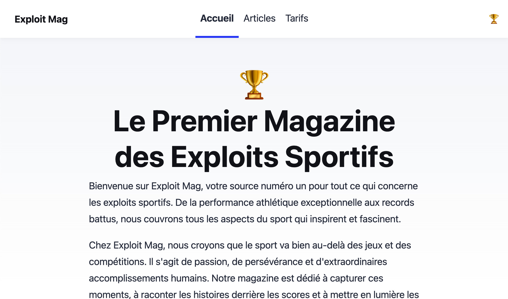
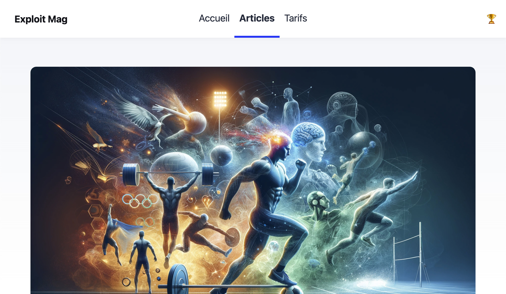
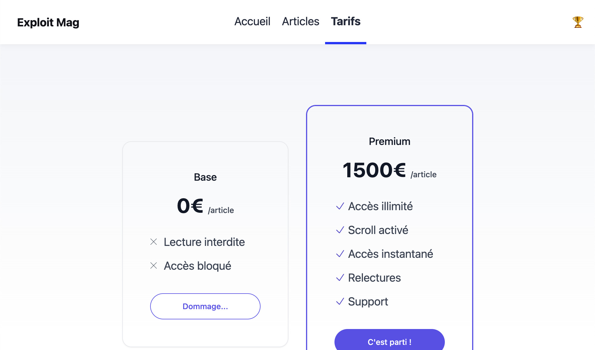
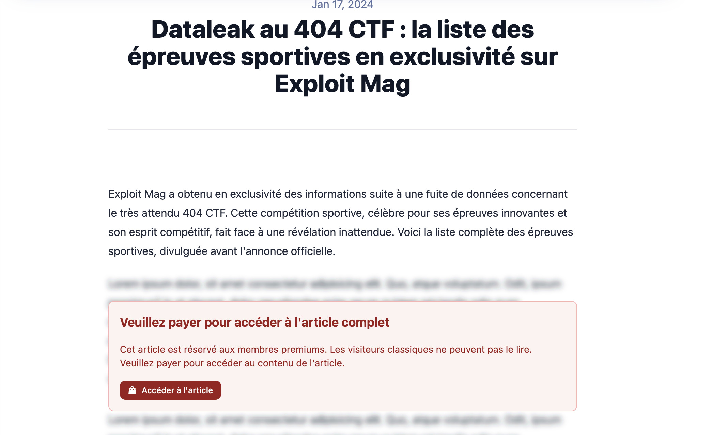
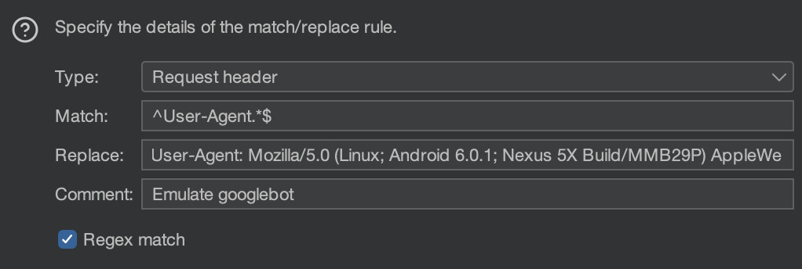
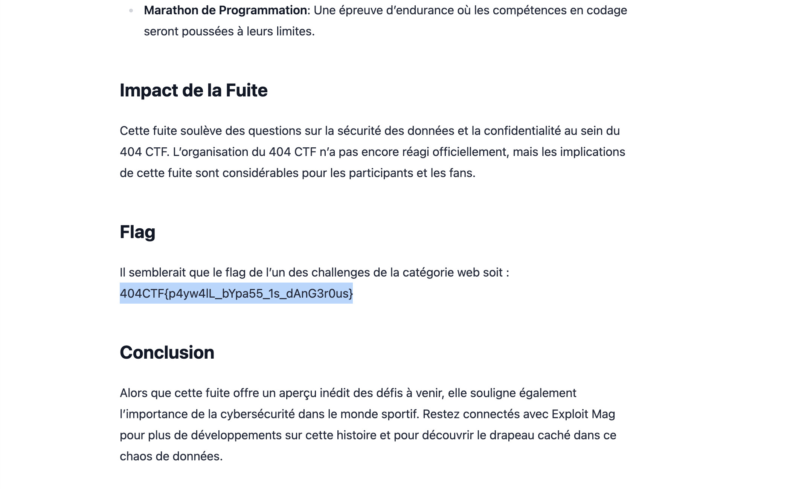

# Exploit mag 🟡

<a class="back-link" href="../../">< Go back</a>

## Description

Alors que la compétition bat son plein, votre entraîneur vient à votre rencontre :

Hey ! Je ne sais pas si tu as vu, mais il parait qu'un magazine en ligne a publié des trucs "intéressants" sur la compétition. C'est un ami à moi qui m'a envoyé le lien.
En allant jeter un œil, rien ne semble différencier ce magazine d'un autre site sportif aux titres racoleurs... Mais l'un des articles attire votre attention. Ce serait bien de pouvoir y accéder, au moins pour savoir ce qu'ont appris les athlètes qui l'ont lu. Mais pas question de payer, il doit bien exister un autre moyen...

<https://exploit-mag.challenges.404ctf.fr>

## Challenge

Exploring the website we don't find much, it's a news website that has a premium feature to access the articles.







But it seems like the paid feature is not trully setup, it doesn't really work, you don't get any cookies or any session or nothing.

Let's try to access an article



As we can see there's a paywall hiding the contents of the article, I've tried about everything:

- The text that's blurred is just lorem ipsum
- Turning of javascript doesn't do anything, this is either served statically or there's a template language behind it.
- Going trough a proxy like <12ft.io> doesn't work either

Let's look at the `robots.txt`:

```
User-agent: Googlebot-news
Disallow:

User-agent: *
Disallow: /news/
```

oh! Googlebot-news is just googlebot, and it seems to have access to everything? this is kind of weird, but let's try it.

Looking online for the googlebot up to date user agent [we find this dev documentation by google](https://developers.google.com/search/docs/crawling-indexing/overview-google-crawlers)

On it we get lots of user agents for googlebot, we learn by the way that Googlebot-news uses the same UA than the generic Googlebot, let's grab one:

```
Mozilla/5.0 (Linux; Android 6.0.1; Nexus 5X Build/MMB29P) AppleWebKit/537.36 (KHTML, like Gecko) Chrome/W.X.Y.Z Mobile Safari/537.36 (compatible; Googlebot/2.1; +http://www.google.com/bot.html)
```

We just need to update `Chrome/W.X.Y.Z` to our current chrome version for example:

```
Mozilla/5.0 (Linux; Android 6.0.1; Nexus 5X Build/MMB29P) AppleWebKit/537.36 (KHTML, like Gecko) Chrome/124.0.6367.60 Mobile Safari/537.36 (compatible; Googlebot/2.1; +http://www.google.com/bot.html)
```

We can create a find and replace rule on Burp suite to be able to explore all the articles without having to bother changing the user agent:



Going trough the pages we successfully bypassed the paywall, and on the last article about a data leak we find our flag:


