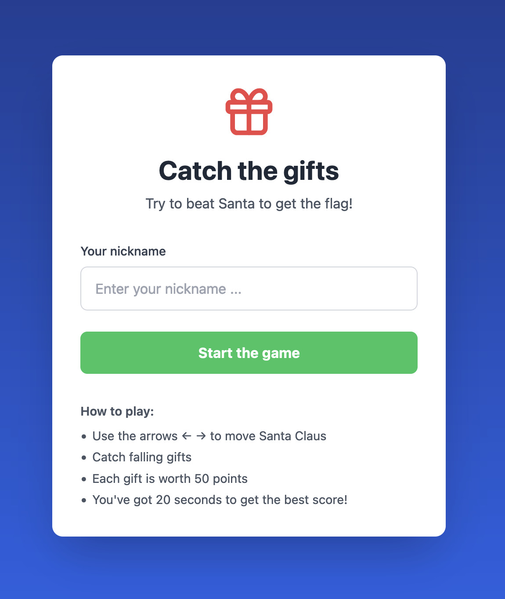
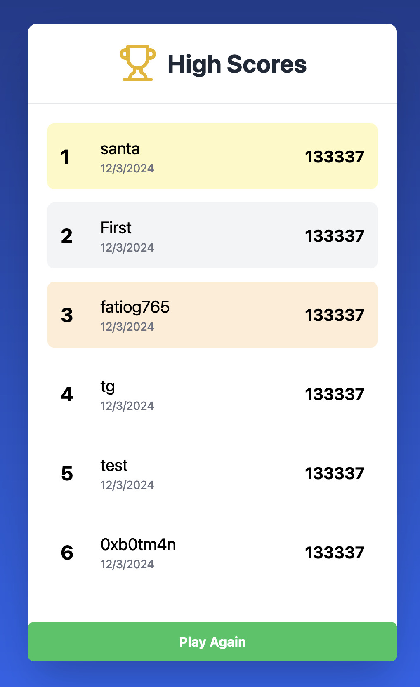

# Day 03 - Santa's Magic Sack

<a class="back-link" href="../../">< Go back</a>

## Description

Santa has developed a web game where you have to catch presents, and as luck would have it, he's come out on top of the scoreboard. Can you beat him?

Author: Elweth
<https://day3.challenges.xmas.root-me.org/>

all files in [resources/](./resources) were provided.

## Challenge

Let's play one game and see what happens.



We input our username and start the game, it's a simple catch the falling object game


Then finally after 20s we get the scoreboard:



Okay so we have to cheat our score to get >133337. Let's look at how the game is made by looking at the source code.

We find a GET request to `/assets/index-DHkGdvNB.js`, this file is a obfuscated mess of different libraries separated by their licenses.

After doing a simple deobfuscation online using any of the thousands of websites that do that, we get a code that is at least readable, but still a pain.

Let's try to find something of use, in the network data of the game when we win we see a POST being sent:

```json
// POST /api/scores HTTP/2
// Host: day3.challenges.xmas.root-me.org
// User-Agent: Mozilla/5.0 ...
// Accept: */*
// Content-Type: application/json
// Origin: https://day3.challenges.xmas.root-me.org

{"data":"U2FsdGVkX1+egqrp7H2a89032ltgC7sBkgS326/nB69QdcwaEMTEjAiElbKWlkLqFQxmXFncFbIg+0cMeHwHCOTHK2mrhnJi+hf8YJVsH786JjtOSmq7nXWFyBRqmQDYoGa9fMCZD24MzUdIa9Oiu0oPhZ/0sE7RNwFLqEoVzVtL0ehhWmyyCCfipqGy0AZZ"}

// HTTP/2 200 OK
// Access-Control-Allow-Origin: *
// Etag: W/"4c-BU2/RJ8eH3/HVEYF1ub4GJXNh4Q"
// Server: Caddy

{"success":true,"isNewRecord":false,"message":"Congratz, but not enough .."}
```

Trying to decipher the base64 hash gives binary data with a `Salted__` prefix, so this doesn't seem to be the way to go.

Let's try to find the API request to `/api/scores` in the code ([deobf.js](deobf.js)):

```js
return await (await fetch("/api/scores", {
    method: "POST",
    headers: {
        "Content-Type": "application/json"
    },
    body: JSON.stringify({
        data: l
    })
})).json()
```

It's a mess, but we find what we are looking for, so now it's just a question of going down the rabbit hole of `data: l` and seeing how the hash is being salted.

After a bit of digging I got the mess that is inside [reversing/index.js](reversing/index.js)

Two things to note, we get the salt: `S4NT4_S3CR3T_K3Y_T0_ENCRYPT_DATA` and the code being obfuscated somehow doesn't reference the external libraries used so I had to manually create a node.js project with crypto-js for both AES and SHA256 methods.

After doing all that and adding a `start` script inside the package.json we can run the program:

```bash
yarn start
# {
#   success: true,
#   isNewRecord: true,
#   flag: "RM{S4NT4_H0PE_Y0U_D1DN'T_CHEAT}",
#   message: 'For reasons of maximum integer size, to not disturb other users your score will not be saved, but well done!'
# }
```
