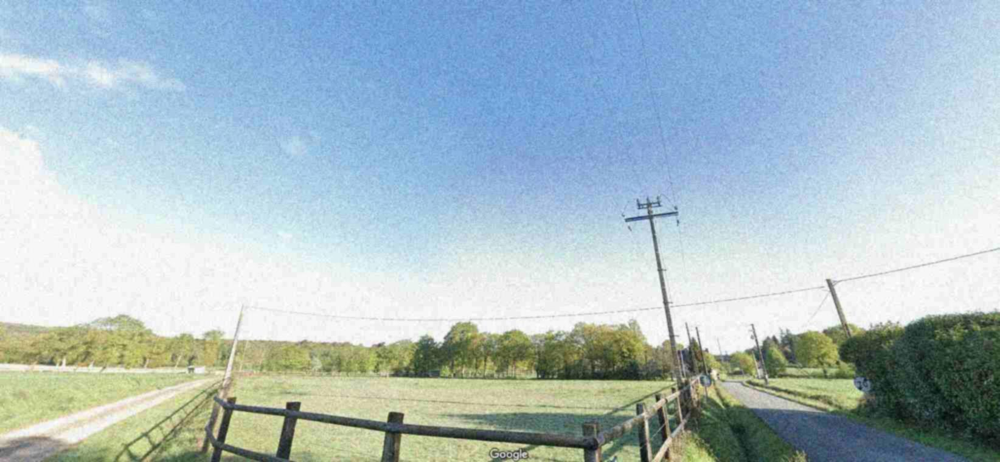
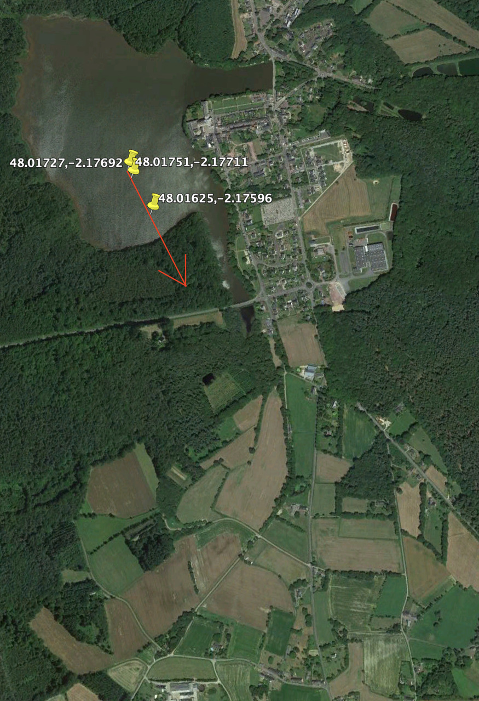
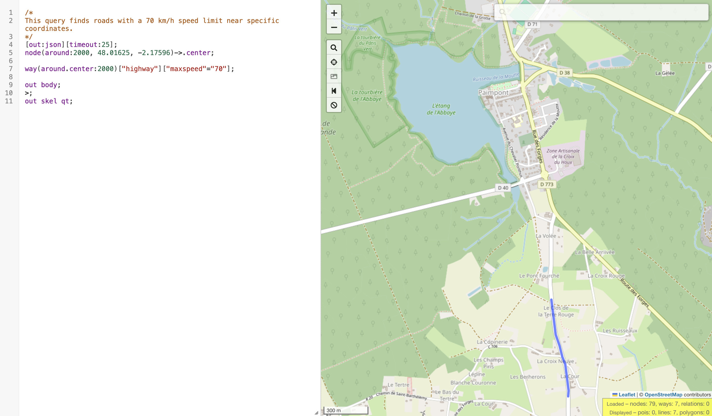

# Day 13 - The list gift

<a class="back-link" href="../../">< Go back</a>

## Description

I couldn't wait and opened one of my christmas presents in advance, my very first FPV drone, I had been eagerly waiting for it. I decided to try it outside, conditions were perfect: sunny, no wind and a safe spot for a maiden flight.

However, shortly after takeoff, my drone flied straight ahead and stopped responding to any of my commands. I saw it disappear in a distance, soaring over the trees, completely out of control. I forgot to activate the FailSafe mode...

Fortunately, I still have the last coordinates from the beacon signal transmitted via Wi-Fi and the last image captured by the video feed.

Could you use these clues to locate my drone?

Flag: RM{streetnamewherethedronelanded}

Example: RM{ruedelapaix}

Author: Chic0s

all files in [resources/](./resources) were provided.

## Challenge

Given the `.pcap` we can look at a Wi-Fi packet (IEEE 802.11) and in the details we can see the lat and lon, details on where the drone was.

From there we can try to plot the coordinates for the last couple of points to get a feel of speed and orientation of where the drone went. Let's use Google Earth:

So we are in the city of Paimpont (🚒) in Bretagne, France.

Now let's try to get more specific, from the image we got we see a traffic sign, that indicated the end of a limitation of 70km/h. Let's try to use Overpass Turbo to look for all the 70km/h roads around this POI:

Perfect we get a handful of roads, one of them is pretty close and on our trajectory, looking there [we find our place](https://maps.app.goo.gl/3FSeNuHVh4E5VoCQ9)!

We have a 50/50 change of getting it from the 2 roads, OSINT being OSINT I got it in the second try :)

`RM{closdelaterrerouge}`

PS: If we follow the trajectory until the end, it is logical that `Clos de la Terre Rouge` is the correct road, even though I'll always hate OSINT for these luck based flags.
