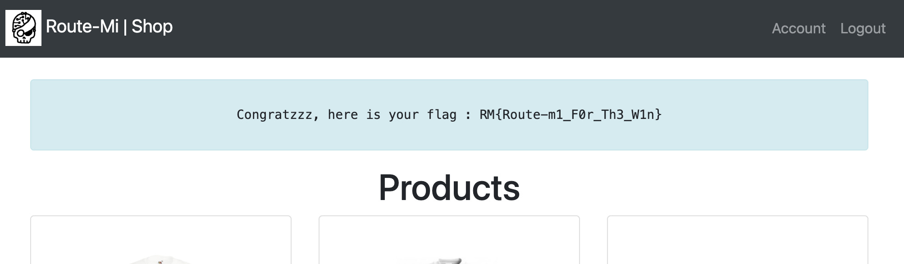

# Day 10 - Route-Mi Shop

<a class="back-link" href="../../">< Go back</a>

## Description

You dreamt it, we did it. The shop for the famous Route-Mi platform is now available. And guess what? We're offering you a €5 discount voucher, so enjoy yourself, it's on us.

Author: Elweth
<https://day10.challenges.xmas.root-me.org/>

all files in [resources/](./resources) were provided.

## Challenge

### Recon

We have a shop, with the flag costing 50€. Creating an account gives us a free 5€ voucher. Though we can only redeem it once.

Looking at the source code we learn that the redeem method (i.e. `POST /discount`) has a delay of 2 seconds with a commit to the database before and after:

```py
def anti_bruteforce(time):
    return sleep(time)

@app.route('/discount', methods=['POST'])
def discount():
  # ...
  balance += 5.0
  user.balance = balance
  db.session.commit()

  anti_bruteforce(2)

  coupon.used = True
  user.can_use_coupon = False
  db.session.commit()
```

Because we get +5€ and after 2s the coupon gets used, we can abuse rush conditions to redeem multiple coupons.

### Exploiting

After some thinking I made a simple [exploit.py](./exploit.py).

Though I first made this exploit a week ago using the `requests` library, and it did not work, I learned this the hard way, `requests` is a **synchronous** HTTP library.


 So because the first request was blocking the rest, I got confused and though that for some reason the challenge was not a race condition. After discussion with friends, I learned that `aiohttp` is the way to go for **asynchronous** HTTP requests.

So after re-writing the exploit with `aiohttp` and trying my best to squeeze as many requests in the first 2s as possible I got the 50€.

Running the [exploit.py](./exploit.py) a couple of times in parallel using bash tasks to improve the squeezening gives us the money! (Using a lower level language could probably prevent having to run multiple tasks, though I'm lazy and I decided to do a good deed this Christmas and help the RootMe team by increasing their server CPU temperature :) I was getting stuck around 45€ so last attempt, I might have gotten >100€ oops)

```sh
python3 exploit.py &; python exploit.py&; python exploit.py&; python exploit.py
```

After all the tasks finish running we can check our balance and buy the flag!


