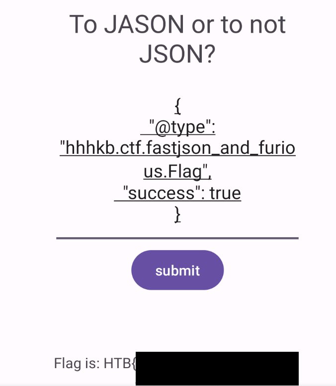

# FastJson and Furious 🟡

<a class="back-link" href="../../../">< Go back</a>

## Description

A couple years ago I was experimenting with Android Development and I created this application to hide my secret, but now I forgot how to get it back. Can you help me?

APK was provided.

## Challenge

Looking at source code with jadx-gui we find two classes inside the `hhhkb.ctf.fastjson_and_furious` package:

### Flag

```java
package hhhkb.ctf.fastjson_and_furious;

public class Flag {
    public void setSuccess(boolean z) {
        MainActivity.succeed = z;
    }
}
```

### MainActivity

```java
package hhhkb.ctf.fastjson_and_furious;

import com.alibaba.fastjson.JSON;

public class MainActivity extends AppCompatActivity {
    public static String POSTFIX = "20240227";
    public static boolean succeed = false;

    protected void onCreate(Bundle bundle) {
        // ...
        final EditText editText = (EditText) findViewById(C1254R.id.input);
        // ...
        JSON.parseObject(editText.getText().toString());
        // ...
        String calcHash = MainActivity.this.calcHash(editText.getText().toString());
        // ...
        System.out.println(calcHash);
        }
    }

    public String calcHash(String str) {
        String str2 = "";
        if (!succeed) {
            return "";
        }
        // ...
        return "HTB{" + bigInteger + "}";
    }
}
```

I stripped a lot of the code, just keeping the bare bones for the exploit. As we can see we are using alibaba's FastJson.

Looking at `com/alibaba/fastjson/JSON`: `VERSION = 1.1.52`, this is a very old version and is the equivalent of emmental cheese. I don't thinks it's necessary to give a specific CVE, the harder part is choosing one.

So our current problem is:

```java
if (!succeed) {
    return "";
}
```

The `succeed` variable is blocking us. Though the `Flag` class has a method that can allow us to change `MainActivity.succeed` to `true`.

Let's try to exploit this using the fastjson RCE exploit. There are hundreds of them, after some trial and error I found the one:

```json
{
  "@type": "hhhkb.ctf.fastjson_and_furious.Flag",
  "success": true
}
```

This essentially is being deserialized by FastJson, `@type` is interpreted by FastJson the type to deserialize to, we are then instantiating our `Flag` class and giving it the parameter `success` as `true`.

Sending this payload we get:

